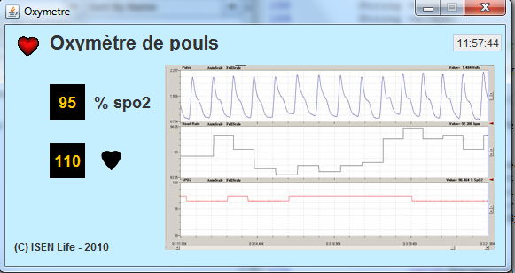

# Projet_A3-Oxymetre_de_pouls

## Présentation
Projet informatique réalisé lors de ma troisième année de prépa à l'ISEN Brest.
 L'objectif est de créer un oxymètre de pouls (et électrocardiogramme) capable de mesurer la vitesse de battements de notre coeur, la concentration d'oxygène dans notre sang, etc...
  
Pour faire ce projet, nous avons utilisé un microcontrôleur STM8 (permettant de récupérer les données issues du capteur, les traiter et les filtrer) programmé avec du langage C, et nous avons affiché les données obtenues (après filtration) dans une interface développé en Java.

## Consignes partie STM8
L'objectif de cette partie était de développer une carte électronique en suivant plusieurs étapes représentées dans ces vidéos : <a href="STM8/videos_projet/">vidéos</a>

## Consignes partie Java
L'ojectif de cette partie était de développer une interface en Java à partir de cette image : <a href="Info/Interface/Images/interface.png">interface.png</a>

